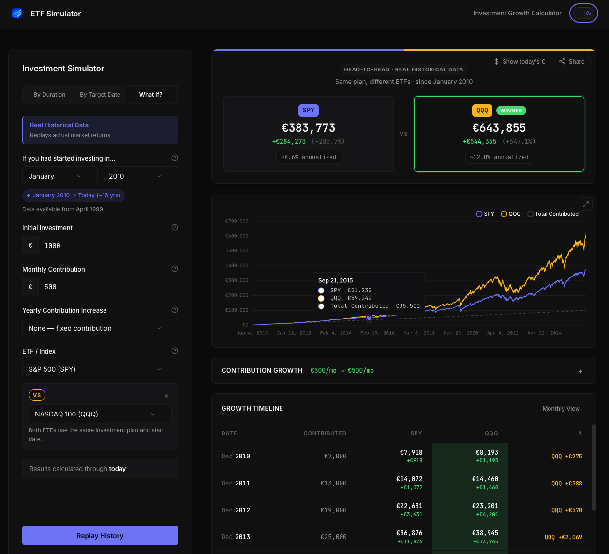

# ETF Simulator

Investment growth calculator using real historical data from Yahoo Finance. Supports forward projections with statistical confidence ranges and historical replay ("what if I had invested in SPY since 2010?").



---

## Features

Three simulation modes:

- **By Duration** — project growth over N years with pessimistic/median/optimistic ranges based on 20-year rolling returns
- **By Target Date** — simulate until a specific date
- **What If (Historical)** — replay a strategy on real daily prices from a chosen start date

Other things it does:

- ETF comparison — run two ETFs side by side on the same contributions
- Custom portfolio — mix multiple ETFs with custom weights
- Contribution growth — fixed annual increase in € or percentage
- Today's € toggle — deflate projections to today's purchasing power (Fisher equation, 2.5% default)
- Shareable URLs — full simulation state encoded in the URL, including the inflation toggle
- Zoomable chart — click to expand with full daily resolution in What If mode
- Dark / light theme

**11 supported ETFs** including UCITS-wrapped and Shariah-compliant options:

| Symbol | Name |
|--------|------|
| SPY | S&P 500 |
| QQQ | NASDAQ 100 |
| EFA | MSCI EAFE (Developed ex-US) |
| EEM | MSCI Emerging Markets |
| VT | Vanguard Total World |
| VWCE.DE | Vanguard FTSE All-World (UCITS) |
| CSPX.L | iShares Core S&P 500 (UCITS) |
| IWDA.L | iShares Core MSCI World (UCITS) |
| IGDA.L | iShares MSCI World Islamic (UCITS, Shariah) |
| AGG | US Aggregate Bond |
| GLD | Gold |

---

## Quick Start

### Docker (recommended)

```bash
docker-compose up --build
```

- Frontend: http://localhost:4200
- Backend API: http://localhost:8080
- Swagger: http://localhost:8080/swagger/index.html

### Local Development

**Backend (Go 1.25+)**

```bash
cd backend
make setup   # install tools (first time only)
make run     # start API on :8080
```

**Frontend (Node 22+)**

```bash
cd frontend
npm install
npm start    # start dev server on :4200
```

---

## How It Works

### Statistical projections (By Duration / By Target Date)

On startup the backend fetches full price history for every ETF and computes rolling annualized returns (20-year window, 10-year fallback). The **5th / 50th / 95th percentiles** become the pessimistic, median, and optimistic return rates fed into the month-by-month simulation engine.

```
For each month:
  balance  *= (1 + monthlyReturnRate)
  balance  += currentContribution
  contribution grows by rate or fixed amount at year boundaries
```

### Historical replay (What If)

The backend fetches daily prices, walks every trading day, applies your contribution on the first trading day of each month, and emits both a `DailyPoint[]` array (for the chart) and monthly snapshots (for the table). The result is a pixel-perfect replay of what your portfolio would have done.

### Inflation adjustment

Toggling **Today's €** applies the Fisher equation to annualized return and deflates all future values and inflates all past values to present purchasing power:

```
real_rate = (1 + nominal) / (1 + inflation) − 1
```

The share URL encodes `real=1` so recipients see the same view you shared.

---

## Architecture

```
┌──────────────────────┐    HTTP    ┌──────────────────────────────┐
│   Angular 21 SPA     │ ◄────────► │        Go REST API           │
│   (Port 4200)        │            │        (Port 8080)           │
│                      │            │                              │
│  Simulation Form     │            │  Yahoo Finance Client        │
│  Portfolio Builder   │            │  Rolling-return statistics   │
│  Growth Chart        │            │  Historical simulation       │
│  Results + Comparison│            │  Prometheus metrics          │
└──────────────────────┘            └──────────────┬───────────────┘
                                                   │
                                                   ▼
                                    ┌──────────────────────────┐
                                    │   Yahoo Finance API      │
                                    │   (daily price data)     │
                                    └──────────────────────────┘
```

Production runs on **Google Cloud Run** with CI/CD via **Cloud Build** (auto-deploy on push to `main`).

---

## API Reference

| Method | Endpoint | Description |
|--------|----------|-------------|
| `GET` | `/health` | Health check |
| `GET` | `/api/v1/indexes` | ETFs with live rolling-return stats |
| `POST` | `/api/v1/simulate/years` | Project by number of years |
| `POST` | `/api/v1/simulate/target` | Project to a target date |
| `POST` | `/api/v1/simulate/historical` | Replay real historical returns |
| `GET` | `/metrics` | Prometheus metrics |
| `GET` | `/swagger/index.html` | Interactive API docs |

### Simulate by years

```bash
curl -X POST http://localhost:8080/api/v1/simulate/years \
  -H "Content-Type: application/json" \
  -d '{
    "initialInvestment": 10000,
    "monthlyContribution": 500,
    "years": 20,
    "indexSymbol": "SPY",
    "contributionGrowthRate": 3
  }'
```

### Custom portfolio

```bash
curl -X POST http://localhost:8080/api/v1/simulate/years \
  -H "Content-Type: application/json" \
  -d '{
    "initialInvestment": 10000,
    "monthlyContribution": 500,
    "years": 20,
    "portfolio": [
      { "symbol": "SPY", "weight": 60 },
      { "symbol": "QQQ", "weight": 30 },
      { "symbol": "EFA", "weight": 10 }
    ]
  }'
```

### Historical replay

```bash
curl -X POST http://localhost:8080/api/v1/simulate/historical \
  -H "Content-Type: application/json" \
  -d '{
    "initialInvestment": 10000,
    "monthlyContribution": 500,
    "startYear": 2015,
    "startMonth": 1,
    "indexSymbol": "VWCE.DE"
  }'
```

---

## Project Structure

```
├── backend/
│   ├── cmd/api/            Entry point
│   ├── internal/
│   │   ├── config/         Env-driven config
│   │   ├── handler/        HTTP handlers + simulation engine
│   │   ├── marketdata/     Yahoo Finance client + IndexService
│   │   ├── metrics/        Prometheus middleware
│   │   └── server/         HTTP server + graceful shutdown
│   └── sdk/                errors, logger
│
├── frontend/
│   └── src/app/
│       ├── core/           Models + services (ApiService, ThemeService)
│       ├── features/       SimulationPage, form, results, chart, comparison
│       └── shared/         CustomSelect, PortfolioAllocator, ThemeToggle
│
├── infra/                  Terraform (Cloud Run + Artifact Registry)
├── docs/                   Screenshots
└── docker-compose.yml
```

---

## Configuration

### Backend environment variables

| Variable | Default | Description |
|----------|---------|-------------|
| `APP_ENV` | `development` | `development` / `staging` / `production` |
| `SERVER_HOST` | `0.0.0.0` | Bind address |
| `SERVER_PORT` | `8080` | Port |
| `CORS_ALLOWED_ORIGINS` | `*` | Comma-separated allowlist or `*` |

### Frontend runtime config

`frontend/src/assets/config.json` is loaded at boot — set `apiUrl` here. In Docker, `config.json.template` is populated by `envsubst` from `$API_URL`.

---

## Adding a new ETF

1. Append to `DefaultSupportedIndexes` in `backend/internal/marketdata/indexservice.go`
2. Mirror it in `returnOptions` in `frontend/src/app/features/simulation/components/simulation-form/simulation-form.component.ts`
3. Deploy — the backend fetches history automatically on startup
